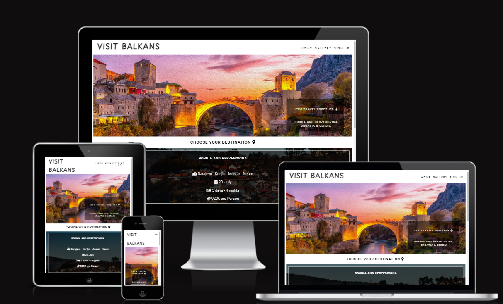
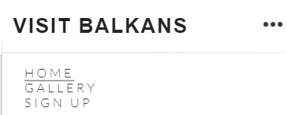
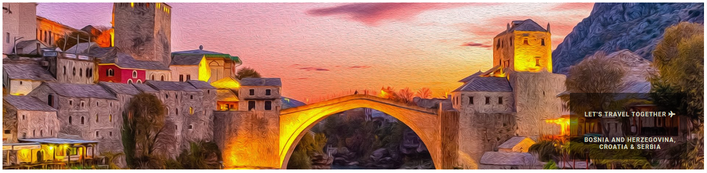
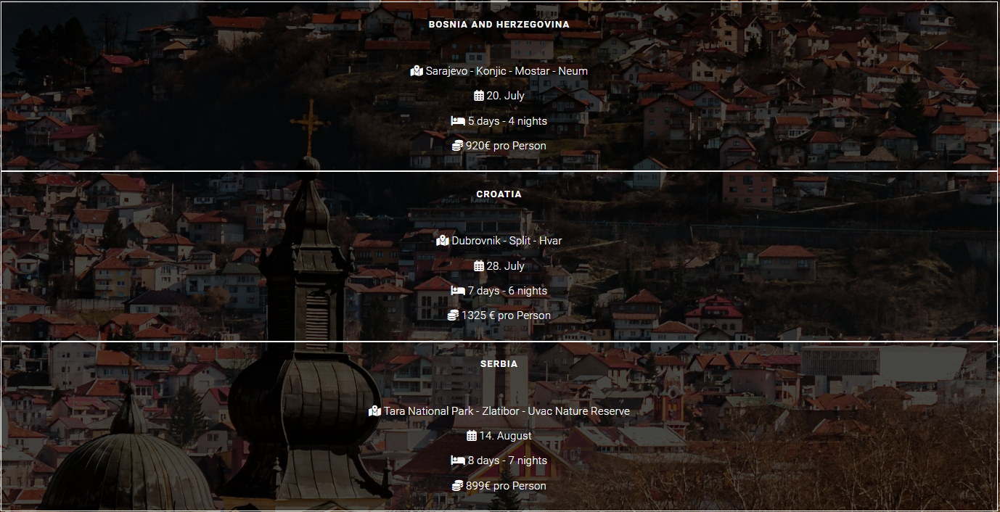
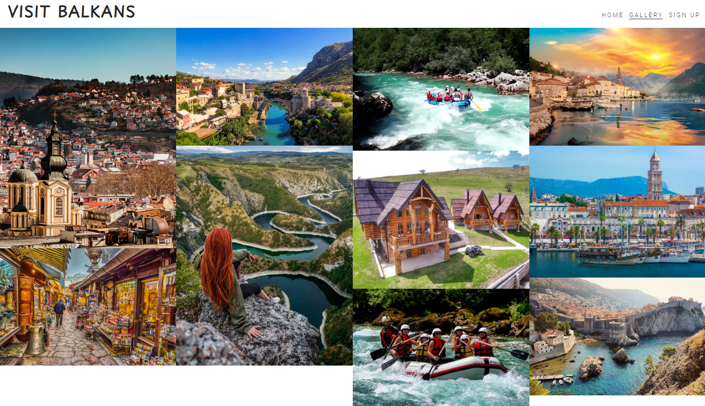
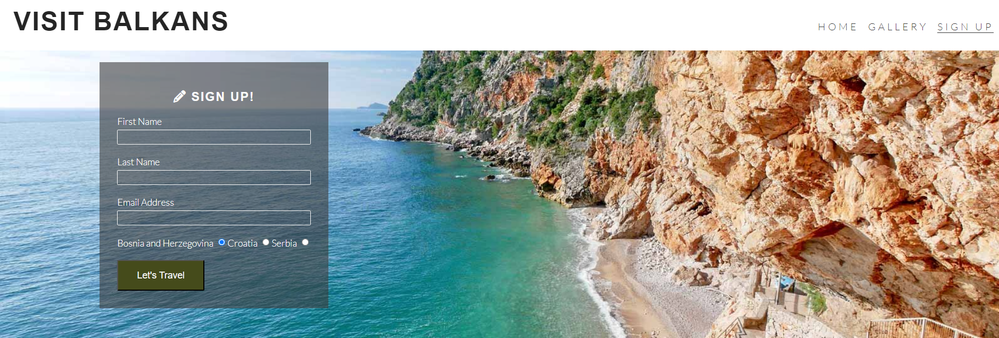
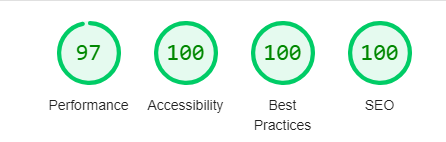

# Visit Balkans

"Visit Balkans" is a travel site for everyone over 18 years old.

Visit Balkan offers arrangements for visiting the Balkan countries: Bosnia and Herzegovina, Croatia and Serbia.
Users of this website can find all the information necessary for travel: destinations, date of travel, number of nights and price of the arrangement per person.

## Features

### **Navbar**

- The left side of Nav bar shows a travel agency name: Visit Balkans.
- Navigation links are to the right: Home, Gallery and Sign Up which link to the new pages.

- Responsive Mobile Menu
  - On mobile devices, the menu opens under the navbar.

### **Hero Image**

- Hero image represents one of the travel destinations (Mostar).
- In the bottom right corner is a small paragraph with travel destinations.

### **Destinations**

- The next section on Home page, shows destinations. There are three options (Bosnia and Herzegovina, Croatia and Serbia) with all necessary information: travel route, date of travel, how many nights and price pro person.

### **Footer**

- Footer section shows social networking like Facebook, Instagram, Twitter and YouTube.
- Click on the icon leads to a specific page.

### **Gallery**

- In the Gallery tab, visitors of the page can see photos from travel destinations.
Photos are responsive on mobile devices as one column, on larger devices in 2/3/4 columns.

### **Sign Up**

- Users can sign up online for travel. Need to fill out all information: First Name, Last Name and E-mail address. Also, choosing destinations is required.

 

## **Testing**

Manual testing was conducted to ensure that the site functions correctly across different browsers and devices. This included checking:

- Responsiveness on various screen sizes (desktop, tablet, and mobile).
- Functionality of navigation links and buttons.
- Form submission and validation.
- Navigation, header, gallery, sign up are easy to find, read and understand.

### **Validator testing**

- HTML Validator
  - No errors or warnings were found when passing through the official HTML validator.
- CSS Validator
  - No errors or warnings were found when passing through the official HTML validator.
- Accessibility
  - Colors and fonts are easy to read and accessible by running them through lighthouse in devtools.

### **Bugs**

- Bug is fixed!

### **Unfixed bugs**

- No unfixed bugs!

## **Deployment**

- This page has been deployed to GitHub pages. The steps to deploy are as follows:
  - In the GitHub respiratory, go to the Settings Tab
  - As a defalut branch, choose main
  - Click to the link to the page

## **Credits**
 - Icons
    - Font Awsome (https://fontawesome.com/)
- Fonts
  - Google Fonts (https://fonts.google.com/)
- Code structure
  - CI Love Running Project
- Hero Photo
 - Mostar (https://wall.alphacoders.com/big.php?i=1051404)
 - Gallery (https://www.google.com/search?q=visit+balkan&sca_esv=3ccb936e91fffbe3&udm=2&biw=1920&bih=911&ei=7sB1ZqWDDIXZ7_UP9tup4AU&ved=0ahUKEwilsoq5pO2GAxWF7LsIHfZtClwQ4dUDCBA&uact=5&oq=visit+balkan&gs_lp=Egxnd3Mtd2l6LXNlcnAiDHZpc2l0IGJhbGthbjIGEAAYCBgeMgcQABiABBgYMgcQABiABBgYSMsMUABYlwtwAHgAkAEAmAFBoAHMBaoBAjEyuAEDyAEA-AEBmAIMoAKJBsICBRAAGIAEwgIEEAAYHsICBxAAGIAEGBPCAggQABgTGAUYHpgDAJIHAjEyoAe6Lw&sclient=gws-wiz-serp)
 